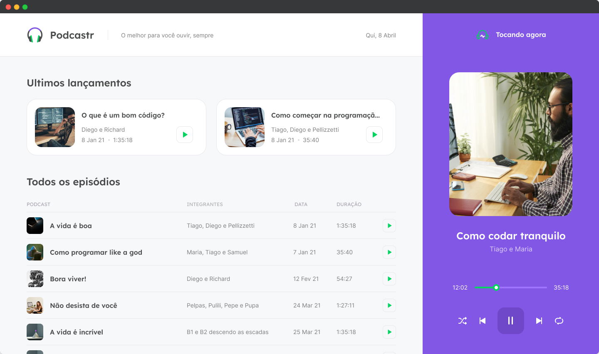

<h1 align="center">
  
</h1>

 

  

## 💻 Projeto

Podcastr é um app para reproduzir episódios em áudio de podcasts.

## 🛠️ Tecnologias e ferramentas:

- React
- Typescript
- Hooks
- Context API
- SSG (geração de site estático, a página é pré-renderizada no momento da compilação)
- ISR (incremental static regeneration, a página é gerada na primeira solicitação, a página final é armazenada em cache e os visitantes consequentes receberão a versão em cache imediatamente, assim como no SSG.)
- Sass

## ❓ Como executar

- Clone o repositório
- Instale as dependências com `yarn install` ou `npm install` caso não tenha o yarn
- Inicie a fake api com `yarn server` ou `npm`
- Inicie o servidor com `yarn dev` ou `npm`

Acesse o [`localhost:3000`](http://localhost:3000) do seu navegador.